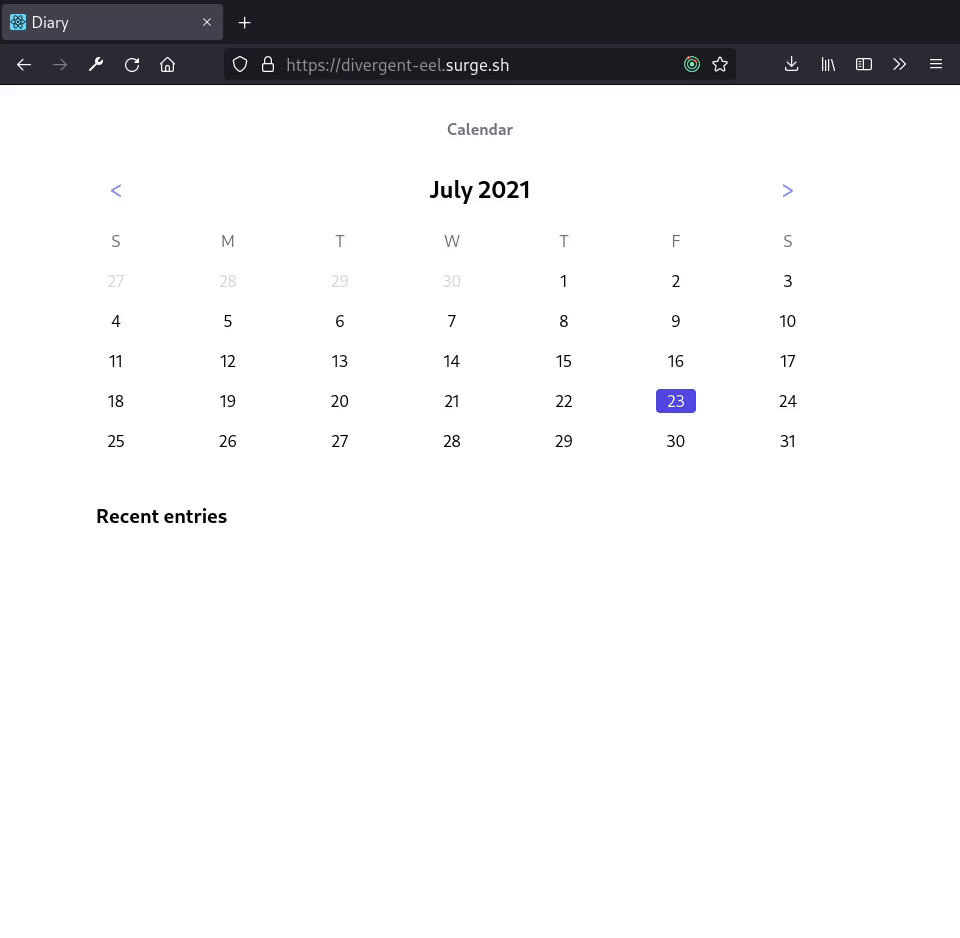

# Diary app

[Link to demo](https://divergent-eel.surge.sh/)



This project is an example of a typescript react, redux, tailwindcss application, tested with react-testing-library.

Originally I was building this as a food diary for myself, but realized it could be used as a normal diary.

Application state lives in the localstorage. As such, clearing browser cache will lose all your data. Export and import state buttons might come in the future.

Any feedback is appreciated.

# Running
```
npm install
npm start
```

# Testing

```
npm test
```
